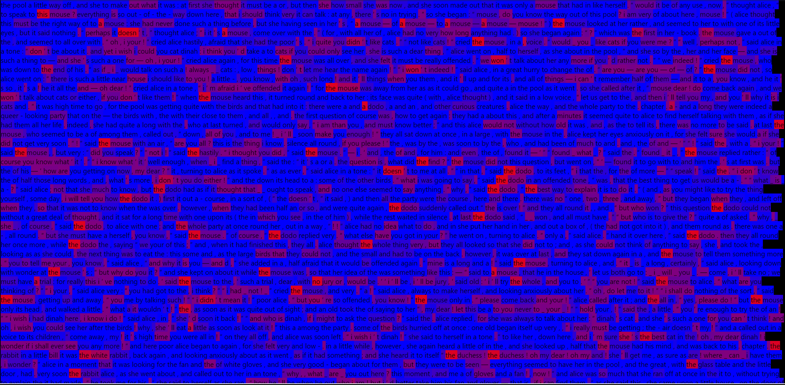

# LSTM - Long Short Term Memory
* RNN that handles **long-term** dependencies. 
* use **gates** to control the flow of information through the network.
* **selectively remember or forget** information as needed.
* maintain and update extra **cell state** in controlled manner through gates.
* disadvatages: **slower** to compute, **diffuclt** to **parallelize**, limited context, **limited interpretability** vs tranformers.
* pseudo code
    ```python
    LSTMCell
        i = sigmoid(wii.x + bii + whi.h + bhi) - input gate.
        f = sigmoid(wif.x + bif + whf.h + bhf) - forget gate.
        o = sigmoid(wio.x + bio + who.h + bho) - output gate.
        g = tanh(wig.x + big + whg.h + bhg) - candidiates.
        c = f*c + i*g - updated cell state.
        h = o*tanh(c) - updated hidden/outout state.
    ```

# Codes Implemented
* Word Level LSTM
* Word level sequence tokenization
* Text Corpus next word prediction pytorch dataloader
* BiLSTM - LSTM1(sequence) + LSTM2(reversed(sequence))
* Embedding visualization
* Neuron Firing Visualizatoin

# WordLSTM Results
* LSTM Generated Text
  ```python
  when i used to read - , i that of thing never , and now here i am in the of one ! 
  there ought to be a book about me , that there ought ! 
  and when i grow up , i ’ ll one — but i ’ m up now , ” she added in a tone ; “ at there ’ s no room to grow up any more _ here _ . ” “ but then , ” thought alice , “ did i your , ” the hatter footman , who had never so much , whether she a look of a - , and was just going to the room , when her upon a little bottle that near the looking - glass . 
  there was no this time with the words “ me , ” but she it and put it to her . 
  “ i know _ something _ is sure to , ” she said to herself , “ i eat or anything ; so i ’ ll just see what this bottle . 
  i do it ’ ll make me grow large again , for really i ’ m quite of being such a little thing ! ” it did so indeed , and much than she had : before she had half the bottle , she found her head the , and had to to her from being . 
  she hastily put down the bottle , saying to herself “ that ’ s quite enough — i i ’ t grow any more — as it is , i can ’ t get out at the door — i do wish i ’ t quite so much ! ” ! 
  it was too to wish that ! 
  she went on growing , and growing , and very soon had to down on the : in another minute there was not even room for this , and she tried the of down with one the door , and the other arm round her head . 
  still she went on growing , and , as a last , she put one arm out of the , and one foot up the , and said to herself “ now i can do no more , . 
  what _ will _ of me ? ” for alice , the little bottle had now had its , and she no : still it was very , and , as there seemed to be no sort of of her ever getting out of the room again , no wonder she felt . 
  “ it was much at , ” thought poor alice , “ when one wasn ’ t always growing and , and being about by and . 
  i wish i ’ t gone down that rabbit - — and yet — and yet — it ’ s rather curious , you know , this sort of life ! 
  i do wonder what _ can _ have to me ! 
  when i used to read - , i that of thing never , and now here i am in the of one ! 
  there ought to be a book about me , that there ought ! 
  and when i grow up , i ’ ll one — but i ’ m up now , ” she added in a tone ; “ at there ’ s no room to grow up any more _ here _ . ” “ but then , ” thought alice , “ shall i _ never _ get any than i am now ? 
  that ’ ll be a , one way — never to be an old — but then — always to have lessons to ! 
  oh , i ’ t like _ that ! _ ” “ oh , you alice ! ” she herself . 
  “ how can you lessons in here ? 
  why , there ’ s hardly room for _ you _ , and no room at all for any - ! ” and so she went on , first one side and then the other , and quite a of it ; but after a minutes she heard a voice , and to . 
  “ ! 
  ! ” said the voice . 
  “ me my gloves this moment ! ” then came a little of feet on the . 
  alice knew it was the rabbit to look for her , and she till she the house , quite that she was now about a as large as the rabbit again , and all her , till she too began after a , and this was her : — first , she of little alice herself , and once again the hands were upon her , and the eyes were looking up into — she could hear the very of her voice , and see that queer little of her head to keep back the that _ would _ always get into her eyes — and still as she , or seemed to , the whole her with the creatures of her little ’ s . 
  the long at her feet as the white rabbit hurried by — the mouse his way through the pool — she could hear the of the as the queen down hurried , here you , ” said the king , his hands , and added with a of , “ i ’ ve tried the of , and i ’ ve tried , and i ’ ve tried , ” the pigeon went on , without to her ; “ but those ! 
  there ’ s no them ! ” alice was more and more , but she thought there was no use in saying anything more till the pigeon had
  ```

* Neuron Firing Visualization
<p align="center">
  
  <br>
  <em>layer2_neuron_247_a_an_the_detector</em>
</p>


# References
* https://citeseerx.ist.psu.edu/viewdoc/download?doi=10.1.1.676.4320&rep=rep1&type=pdf
* https://colah.github.io/posts/2015-08-Understanding-LSTMs/
* https://pytorch.org/docs/stable/generated/torch.nn.LSTMCell.html