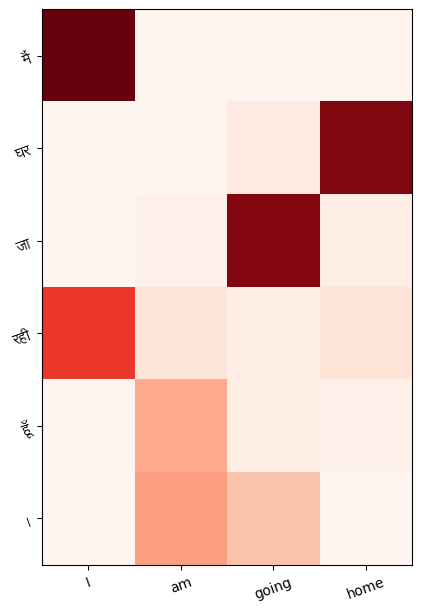

# Transformers - Attention is All You Need
* **Attention** mechanisms to compute **representations** of input sequences.
* capture **long-range dependencies** and **global context** through attention.
* **No sequential** processing, easy to parallelize.
* Multi headed attention
    * Lower computation cost - concat(emb_dim/heads) vecs
    * Specialized heads for various latent tasks
* **scaled dot-product attention** which computes a weighted sum of values based on the **dot product** between **queries and keys**.
* NN with **input** [dependent](https://twitter.com/rasbt/status/1629884953965068288?s=20) **weights**.
* **less Biased** compared to CNNs
* disadvatages: **Training complexity** and **memory footprint**, **diffuclt** to **parallelize**, limited **context size**.
* pseudo code for **Multi Headed Scaled Dot-Product Attention**
    ```python
    MHA(Q, K, V) = Concat(head0, ..., headn) x W
    head:
        Q, K, V = (q x Wq), (k x Wk), (v x Wv)
        Attention(Q, K, V) = softmax((Q x K.T)/(sqrt(dk))) x V
    ```

# Codes Implemented
* QKV MHA
* self-attention, causal attention, cross-attention
* Sinusoidal Position Embedding
* Tranformer Encode Decoder
* English to English tokenizer
* English to Hindi Translation custom data loader and collater
* Attention visualization 

# English-Hindi Translation Results
* Sample Translations
    ```python
    IN:  They both are teachers . 
    OUT: वे दोनों अध्यापक हैं ।   

    IN:  You said you would n't do that . 
    OUT: तुम्हें ने कहा कहा । तुम वैसा नहीं । । 

    IN:  Tom was naked .          
    OUT: टॉम नंगा था ।             

    IN:  You made me lose my mind .  
    OUT: तुमने मेरी पागल कर दिया ।    

    IN:  I believe you like your job .    
    OUT: मुझे लगता है कि तुम तुम्हारा काम अच्छा लगता है । 
    ```

* Cross Attention Visualization
<p align="center">
  
  <br>
  <em></em>
</p>

# References
* https://proceedings.neurips.cc/paper/2017/file/3f5ee243547dee91fbd053c1c4a845aa-Paper.pdf
* https://github.com/lucidrains/x-transformers
* https://nlp.seas.harvard.edu/2018/04/03/attention.html
* http://peterbloem.nl/blog/transformers
* https://jalammar.github.io/illustrated-transformer/